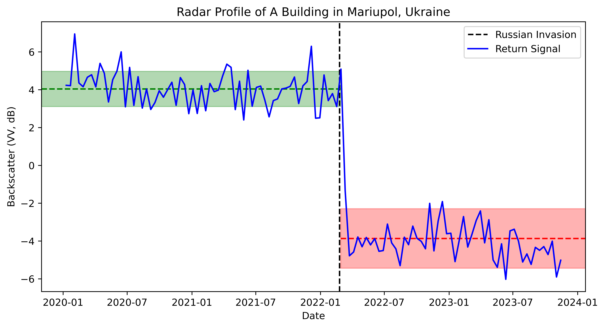
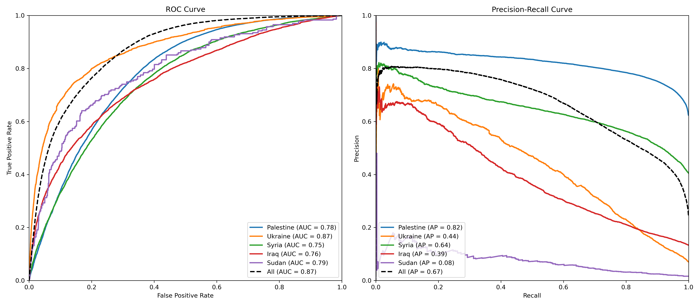

<h1 align="center">Pixel-Wise T-Test</h1>
<h2 align="center">A New Algorithm for Battle Damage Detection using Sentinel-1 Imagery </h2>

<p align="center">

[](https://arxiv.org/pdf/2405.06323)  [](https://colab.research.google.com/github/oballinger/PWTT/blob/main/pwtt_quickstart.ipynb)   [](https://drive.google.com/file/d/1AjsCJ5Wc0xDRUcc0VHtATLWee2lVN8RM/view?usp=sharing)

</p>


The generation of public information regarding buildings damaged by conflict has become particularly important in the context of recent, highly destructive wars in Gaza and Ukraine. This paper develops the Pixelwise T-Test (PWTT), a new algorithm for open-access battle damage estimation that is accurate, lightweight, and generalizable. The PWTT addresses many of the problems associated with expense, coverage consistency, and domain shift that affect deep-learning based approaches to building damage detection, and outperforms the state of the art deep learning model on unseen areas. 

## How it Works 

The PWTT utilizes Synthetic Aperture Radar imagery from the Sentinel-1 satellite. The figure below demonstrates the change in backscatter amplitude (i.e., the "loudness" of the signal's echo) for a destroyed building in Mariupol, Ukraine, before and after its destruction. The corresponding Sentinel-1 pixel has a low standard deviation in both the pre-and post-war periods, but experiences a large change in mean amplitude. The T-Test is a simple signal-to-noise ratio that measures the difference between the means of two samples adjusted by the standard deviation within each sample.



The green dashed line and shaded area represent the pixel's mean backscatter amplitude $\pm$ 1 standard deviation prior to the invasion, while the red line and shaded area represent these statistics following the building's destruction.

## Python Quickstart [](https://colab.research.google.com/github/oballinger/PWTT/blob/main/pwtt_quickstart.ipynb)


First, clone the repository and navigate to the code directory 

```python
!git clone https://github.com/oballinger/PWTT
!cd PWTT/code
```

Then, import the Google Earth Engine python API and authenticate using your credentials and cloud project name. 

```python
import ee
import pwtt

project_name='<YOUR PROJECT NAME>'
ee.Authenticate()
ee.Initialize(project=project_name)
```

finally, the PWTT can be deployed in one line of code. The example below conducts a damage assessment over Gaza for July 2024.

```python
gaza = ee.Geometry.Rectangle([34.21,31.21,34.57,31.60])

pwtt.filter_s1(aoi=gaza, # the area of interest as a bounding box
                   war_start='2023-10-10', # the start of the war
                   inference_start='2024-07-01', # the beginning of the inference window
                   pre_interval=12, # the number of months before the war to use as a reference period 
                   post_interval=1, # the number of months after the war to use as an inference period 
                   viz=True) # visualize the results
```

By simply modifying the location, war_start date and inference_start dates, damage assessment can be carried out on a new area; below is another example for Bakhmut, Ukraine:

```python
bakhmut = ee.Geometry.Rectangle([37.949421, 48.556181, 38.043834, 48.621584])

pwtt.filter_s1(aoi=bakhmut,
                   war_start='2022-02-22',
                   inference_start='2024-07-01',
                   pre_interval=12,
                   post_interval=1,
                   viz=True)
```

## Validation Data 

Accuracy assessments are carried out using an original dataset of 700,500 annotated building footprints, spanning 12 cities in four different countries. This dataset was compiled by spatially joining damage annotations from the United Nations Satellite Centre (UNOSAT) with data on building footprints. The dataset can be downloaded [here](https://drive.google.com/file/d/1AjsCJ5Wc0xDRUcc0VHtATLWee2lVN8RM/view?usp=sharing).

<h3 align="center">Benchmark Dataset</h3>

| Country   | City        | Footprints | Percent Damaged | Annotation Date |
|-----------|-------------|-------------|-----------------|-----------------|
| Palestine | Gaza        | 220160      | 57.21%          | 2024-05-03      |
| Ukraine   | Lysychansk  | 22280       | 7.77%           | 2022-09-21      |
| Ukraine   | S'odonetsk  | 7085        | 25.43%          | 2022-07-27      |
| Ukraine   | Rubizhne    | 9905        | 33.81%          | 2022-07-09      |
| Ukraine   | Kharkiv     | 122590      | 0.91%           | 2022-06-15      |
| Ukraine   | Mariupol    | 20481       | 32.57%          | 2022-05-12      |
| Ukraine   | Hostomel    | 4728        | 14.11%          | 2022-03-31      |
| Ukraine   | Irpin       | 7917        | 11.56%          | 2022-03-31      |
| Ukraine   | Chernihiv   | 33733       | 3.36%           | 2022-03-22      |
| Syria     | Raqqa       | 26728       | 45.78%          | 2017-10-21      |
| Syria     | Aleppo      | 73634       | 31.45%          | 2016-09-18      |
| Iraq      | Mosul       | 151259      | 11.59%          | 2017-08-04      |

Building footprint data is sourced from the Microsoft Building Footprints dataset, which consists of over 1 billion building footprints derived from high resolution satellite imagery around the world. A building footprint is labeled as damaged if it intersects with a UNOSAT damage annotation point, and labeled undamaged otherwise. UNOSAT annotations are generated manually on the basis of high resolution optical satellite imagery.

## Accuracy Assessment

The table below reports the accuracy statistics for the PWTT algorithm in 12 cities, assessed using the benchmark dataset above. 

| City        | AUC   | F1    | Precision | Recall | N      |
|-------------|-------|-------|-----------|--------|--------|
| Gaza        | 83.13 | 78.72 | 71.68     | 87.3   | 220160 |
| Lysychansk  | 77.5  | 52.47 | 46.24     | 60.64  | 22280  |
| S'odonetsk  | 69.36 | 64.98 | 50.28     | 91.84  | 7085   |
| Rubizhne    | 77.72 | 67.5  | 68.55     | 66.48  | 9905   |
| Kharkiv     | 78.66 | 27.72 | 25.03     | 31.06  | 122590 |
| Mariupol    | 70.48 | 71.58 | 61.38     | 85.84  | 20481  |
| Irpin       | 83.94 | 59.41 | 54.53     | 65.24  | 7917   |
| Hostomel    | 86.25 | 73.49 | 67.66     | 80.41  | 4728   |
| Chernihiv   | 84.65 | 46.92 | 53.07     | 42.05  | 33733  |
| Raqqa       | 76.38 | 75.22 | 66.27     | 86.95  | 26728  |
| Mosul       | 76.16 | 42.91 | 39.16     | 47.46  | 151259 |
| Aleppo      | 74.42 | 65.15 | 52.71     | 85.27  | 73634  |
| **All**     | 82.0  | 60.92 | 51.22     | 75.16  | 700500 |

Reciever-Operating Characteristic (ROC) curves for each country are also provided below.
